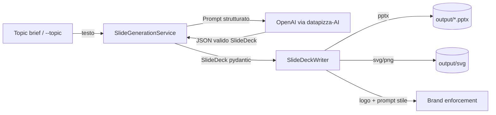
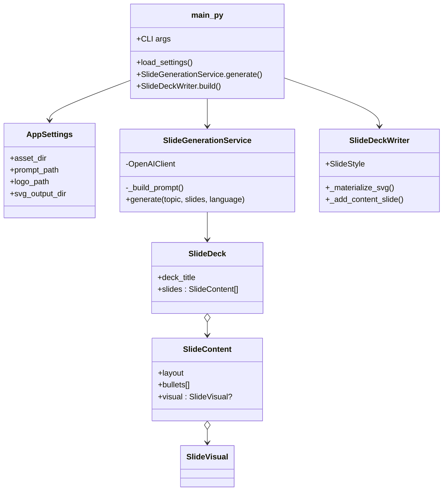

# Slide Generator Datapizza

Generatore di presentazioni aziendali brandizzate Datapizza. Usa la libreria `datapizza-AI` per orchestrare OpenAI via structured output, costruisce un deck coerente con lo stile definito in `Asset/prompt.md` e converte eventuali visual SVG in immagini pronte per PowerPoint.

## Setup rapido

```bash
cd "Slide Generator"
python3.11 -m venv slide           # se l'ambiente non esiste ancora
source slide/bin/activate
pip install -r <(pip freeze)       # opzionale: reinstallare dipendenze
```

Requisiti fondamentali già risolti nello repo:

- `OPENAI_API_KEY` salvata in `.env`.
- Virtualenv `slide/` con `datapizza-AI`, `python-pptx`, `cairosvg`.

## Come si usa

1. Inserisci il brief nella cartella `Topic/` (es. `Topic/Arkemis_Kinetica.md`) oppure passalo via CLI.
2. (Opzionale) Aggiorna `Asset/prompt.md` con regole grafiche / CTA.
3. Esegui:

```bash
cd "Slide Generator"
source slide/bin/activate
python main.py --topic-file Topic/Arkemis_Kinetica.md --slides 8
```

Output:

- PPTX generato in `output/deck_YYYYMMDD_HHMM.pptx`.
- SVG e PNG dei visual in `output/svg/slide_##.svg|png`.

Modalità utili:

- `--topic "Testo breve"` per evitare file esterni.
- `--dry-run` per visualizzare solo il JSON strutturato (nessun PPT).
- `--language`, `--model`, `--slides` per override rapidi.

## Architettura

### Flusso dati



### Componenti principali



## Dettagli funzionali

- **Prompting** (`app/slide_service.py`): crea un prompt con regole stilistiche, richiede output JSON conforme allo schema pydantic (`SlideDeck`). Ogni slide contiene layout suggerito (`text_only`, `split`, `visual_full`) e, se utile, un blocco `visual` con SVG inline e caption.
- **Structured output**: `SlideGenerationService` usa `OpenAIClient.structured_response(...)` per garantire risposte valide, evitando parsing manuale.
- **Rendering PPT** (`app/ppt_builder.py`):
  - Layout dinamico in base al campo `layout`.
  - Conversione SVG→PNG con `cairosvg` e embedding nella slide; fallback a testo descrittivo se l’SVG non è disponibile.
  - Posizionamento automatico del logo e palette/typo da `SlideStyle`.
- **Settings** (`app/settings.py`): centralizza path asset, output, svg cache e imposta le directory mancanti.

## Personalizzazione

- Aggiorna `Asset/prompt.md` per modificare palette, tone of voice, layout rules.
- Modifica i modelli in `app/slide_models.py` per aggiungere campi (es. CTA, metriche) e ri-eseguire: il JSON renderà automaticamente i nuovi dati.
- Personalizza `_add_content_slide` per nuovi layout (timeline, quote, ecc.) oppure integra template SVG già pronti in `_materialize_svg`.

## Troubleshooting

- **Errore API**: verifica `OPENAI_API_KEY` in `.env` o esporta la variabile prima di eseguire.
- **Font mancanti**: PowerPoint userà fallback se Poppins/Lato non sono installati; installali sul sistema per avere resa identica.
- **SVG assente**: se l’LLM non genera `visual.svg_markup`, il builder inserisce una descrizione testuale; aggiorna il brief per incoraggiare visual più descrittivi.

Buona creazione di deck! 🎯
