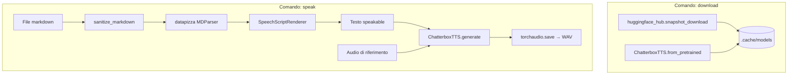

# Voxtral Terminal Backend

Backend **CLI** in Python per: scaricare in locale gli asset di uno **Space Hugging Face** collegato a Voxtral, trasformare un file **Markdown** in testo “parlabile” tramite **datapizza-ai**, e generare **audio con voce clonata** in locale usando **Chatterbox TTS** (Resemble AI).

> **Nota sul nome “Voxtral”:** il repository punta di default allo Space pubblico [`mistralai/voxtral-tts-demo`](https://huggingface.co/spaces/mistralai/voxtral-tts-demo) e ne può scaricare i file con `huggingface_hub`. La **sintesi vocale** implementata in questo codice è **Chatterbox** (`chatterbox-tts`) con `generate(..., audio_prompt_path=...)`, non un runtime Voxtral integrato nel CLI `speak`.

---

## Indice

1. [Funzionalità](#funzionalità)
2. [Architettura e flusso](#architettura-e-flusso)
3. [Struttura del repository](#struttura-del-repository)
4. [Requisiti](#requisiti)
5. [Installazione](#installazione)
6. [Configurazione (`.env`)](#configurazione-env)
7. [Utilizzo della CLI](#utilizzo-della-cli)
8. [Dettaglio del codice](#dettaglio-del-codice)
9. [Test](#test)
10. [Sviluppo e dipendenze](#sviluppo-e-dipendenze)

---

## Funzionalità

| Area | Cosa fa il codice |
|------|-------------------|
| **Download** | `snapshot_download` del repo Hugging Face configurato (default: Space `mistralai/voxtral-tts-demo`) sotto `.cache/models/...`; inoltre **precarica** i pesi **ChatterboxTTS** (`from_pretrained`) sul device scelto. |
| **Extract text** | Legge un `.md`, lo normalizza (rimozione codice, link, enfasi, ecc.), lo analizza con il parser markdown **datapizza**, produce **una stringa** continua adatta alla lettura (titoli, frasi, elenchi come frasi). |
| **Speak** | Stesso testo dell’estrazione → **Chatterbox** con **audio di riferimento** → file **WAV** su disco (`torchaudio.save`). |

Parametri di generazione esposti: `exaggeration`, `cfg-weight`, `temperature` (allineati all’API `generate` di Chatterbox).

---

## Architettura e flusso



**Selezione device (PyTorch):** se non passi `--device`, viene usato automaticamente `cuda` se disponibile, altrimenti `mps` (Apple Silicon), altrimenti `cpu` (`devices.resolve_torch_device`).

---

## Struttura del repository

```
.
├── pyproject.toml          # Metadati progetto, dipendenze, entrypoint CLI
├── requirements.txt        # Dipendenze runtime (mirror del pyproject; senza extras)
├── .env.example            # Variabili d’ambiente documentate
├── audio.wav               # Esempio di voce di riferimento (è versionato: eccezione in .gitignore)
├── samples/
│   └── demo.md             # Markdown di esempio
├── src/
│   └── voxtral_terminal_backend/
│       ├── cli.py          # argparse: download | extract-text | speak
│       ├── config.py       # AppConfig + caricamento .env
│       ├── devices.py      # Risoluzione device torch
│       ├── markdown_pipeline.py  # Pipeline datapizza + sanitizzazione
│       ├── models.py       # Download HF + preload Chatterbox
│       └── tts.py          # VoiceCloningService (Chatterbox + script da markdown)
└── tests/
    └── test_markdown_pipeline.py
```

Cartelle tipicamente ignorate da Git (vedi `.gitignore`): `.venv/`, `.env`, `.cache/`, `outputs/`, `downloads/`, la maggior parte dei `.wav` (tranne `audio.wav`).

---

## Requisiti

- **Python 3.11** — nel `pyproject.toml`: `requires-python = ">=3.11,<3.12"`.
- **Spazio disco e RAM** — Chatterbox e PyTorch scaricano pesi al primo utilizzo; la prima esecuzione può richiedere tempo.
- **Account / token Hugging Face** — per `download`, se il repo è privato o richiede autenticazione, configura le credenziali HF come da documentazione `huggingface_hub` (variabili d’ambiente standard, es. `HF_TOKEN`).

Non è dichiarata nel `pyproject.toml` alcuna dipendenza dal **client API Mistral** (`mistralai`): il progetto usa **Mistral** solo come namespace dello Space HF di default. Un commento in `.env.example` per `MISTRAL_API_KEY` è riservato a **eventuali estensioni** future, non usato dal codice attuale.

---

## Installazione

### Con uv (consigliato)

[Installazione di uv](https://docs.astral.sh/uv/getting-started/installation/)

```bash
cd /percorso/del/progetto
uv venv --python 3.11
uv pip install -e ".[dev]"
cp .env.example .env
```

Equivalente con lockfile gestito da uv:

```bash
uv venv --python 3.11
uv sync --extra dev
cp .env.example .env
```

### Solo librerie da `requirements.txt`

Utile per installare le dipendenze dichiarate **senza** installare subito il pacchetto in modalità editabile:

```bash
uv venv --python 3.11
uv pip install -r requirements.txt
```

Per usare l’entrypoint **`voxtral-backend`** serve comunque:

```bash
uv pip install -e ".[dev]"
```

### Con venv + pip

```bash
python3.11 -m venv .venv
source .venv/bin/activate   # Windows: .venv\Scripts\activate
python -m pip install --upgrade pip
python -m pip install -e ".[dev]"
cp .env.example .env
```

---

## Configurazione (`.env`)

All’avvio, `config.load_dotenv()` carica le variabili dal file `.env` nella working directory.

| Variabile | Default | Ruolo |
|-----------|---------|--------|
| `MODEL_CACHE_DIR` | `.cache/models` | Radice cache modelli e snapshot HF |
| `VOXTRAL_REPO_ID` | `mistralai/voxtral-tts-demo` | Repo Hugging Face da scaricare con `download` |
| `VOXTRAL_REPO_TYPE` | `space` | Tipo repo per `snapshot_download` (`space`, `model`, …) |

La directory locale derivata è: `{MODEL_CACHE_DIR}/voxtral/{VOXTRAL_REPO_ID con / → __}`.

---

## Utilizzo della CLI

Entrypoint: **`voxtral-backend`** (`voxtral_terminal_backend.cli:main`).

Dopo l’installazione in editable mode:

```bash
voxtral-backend --help
```

Oppure senza attivare il venv: `uv run voxtral-backend --help`.

### `download`

Scarica gli asset dello Space/repo HF configurato e precarica Chatterbox.

```bash
voxtral-backend download [--skip-voxtral] [--device cpu|mps|cuda]
```

- `--skip-voxtral`: non esegue `snapshot_download` per Voxtral; esegue solo il preload di **Chatterbox**.
- `--device`: device PyTorch per `ChatterboxTTS.from_pretrained` (default: auto come in `devices.py` se omesso qui — nel codice viene passato `device=args.device`, quindi `None` attiva la risoluzione automatica).

### `extract-text`

Stampa su **stdout** il testo speakable derivato dal markdown (utile per debug).

```bash
voxtral-backend extract-text --markdown samples/demo.md
```

### `speak`

Genera il WAV con voce clonata.

```bash
voxtral-backend speak \
  --markdown samples/demo.md \
  --reference-audio audio.wav \
  --output outputs/demo.wav \
  [--device cpu|mps|cuda] \
  [--exaggeration 0.5] \
  [--cfg-weight 0.5] \
  [--temperature 0.8]
```

Default interni: `--reference-audio audio.wav`, `--output outputs/output.wav`.

La cartella parent di `--output` viene creata se mancante.

---

## Dettaglio del codice

### Pipeline markdown (`markdown_pipeline.py`)

1. **`sanitize_markdown`**: rimuove blocchi di codice, semplifica link e immagini, strip markdown line/block quote, normalizza elenchi, toglie enfasi `*_~`, comprime linee vuote.
2. **`SpeakableMarkdownParser`**: scrive il markdown pulito in un file temporaneo e invoca **`datapizza` `MDParser`**.
3. **`SpeechScriptRenderer`**: attraversa l’albero `Node` (sezioni → titolo come frase; frasi → contenuto con punteggiatura finale).

### TTS (`tts.py`)

- **`VoiceCloningService`**: carica **`ChatterboxTTS.from_pretrained`**, applica una **patch** su `perth` se `PerthImplicitWatermarker` non esiste (usa `DummyWatermarker`), come mitigazione nei confronti della versione installata di `resemble-perth`.
- **`synthesize_markdown`**: script da pipeline + `synthesize_text`.
- Salvataggio: **`torchaudio.save`** con sample rate `self._model.sr`.

### Download (`models.py`)

- **`download_voxtral_assets`**: `snapshot_download` verso `config.voxtral_local_dir`.
- **`download_voice_cloner_assets`**: stessa patch `perth`, poi `ChatterboxTTS.from_pretrained`.

---

## Test

```bash
pytest
```

oppure `uv run pytest`. I test coprono **sanitizzazione**, **punteggiatura** e **rendering** della pipeline markdown su file temporanei (`tests/test_markdown_pipeline.py`). Non ci sono test di integrazione che eseguono Chatterbox o il download HF (richiederebbero pesi e rete).

---

## Sviluppo e dipendenze

Dipendenze runtime dichiarate in `pyproject.toml`:

- `chatterbox-tts==0.1.7`
- `datapizza-ai==0.1.0`
- `huggingface_hub>=1.8.0`
- `python-dotenv>=1.2.2`
- `soundfile==0.13.1`
- `torchaudio==2.6.0`

Extra **`dev`**: `pytest==9.0.2`.

Il file **`requirements.txt`** deve restare allineato alle dipendenze runtime se modifichi il `pyproject.toml` (o rigeneralo manualmente).

---

## Riferimenti

- Space Hugging Face di default: [mistralai/voxtral-tts-demo](https://huggingface.co/spaces/mistralai/voxtral-tts-demo)
- Chatterbox: [resemble-ai/chatterbox](https://github.com/resemble-ai/chatterbox)
